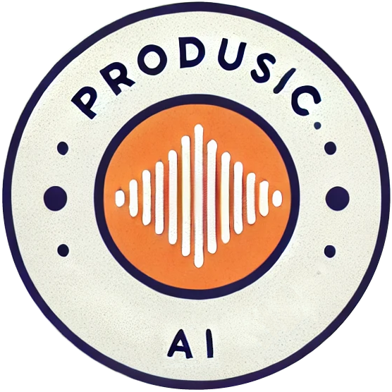

#  ProdusicAI - Music Production AI Assistant

An intelligent chat interface for music production assistance, powered by Azure OpenAI and LangChain. The application uses a combination of RAG (Retrieval Augmented Generation) and specialized AI agents to provide contextual advice about music production techniques.

The RAG system draws from a CSV file containing music production techniques that I have collected over the years from listening to other songs. Where possible they contain a reference song. The Youtube API is used to fetch a video for the suggested song.

The app can either pull a random idea from a given category from the RAG system, or it can be used interactively to ask questions. General questions will also pull any relevant ideas from the RAG system.

## Features

- 🎵 Specialized AI agents for different aspects of music production:
  - Composer: Arrangement and music theory
  - Mixing Engineer: Audio processing and mixing
  - Sound Designer: Sound synthesis and design
  - Lyricist: Songwriting and lyrics
  - Project Manager: Overall production guidance

- 📚 RAG-powered knowledge base with real music production techniques
- 🎥 Automatic YouTube example suggestions
- 📝 Interactive chat interface with suggested prompts
- 🔍 Debug logging panel

## Prerequisites

- Python 3.12 or higher
- Azure OpenAI API access
- YouTube API key

## Installation

1. Clone the repository:
```bash
git clone https://github.com/zilch42/ProdusicAI.git
cd ProdusicAI
```

2. Install dependencies and setup environment:
This a project is set up to use `uv`. See here to install it if you don't have it already:
[https://docs.astral.sh/uv/getting-started/installation/](https://docs.astral.sh/uv/getting-started/installation/)

```bash
uv sync
```

3. Create a `.env` file with your API keys:
```
AZURE_OPENAI_API_KEY=your_key_here
AZURE_OPENAI_ENDPOINT=your_endpoint_here
AZURE_OPENAI_API_VERSION=your_version_here
YOUTUBE_API_KEY=your_youtube_api_key
```

The App is currently configured to use Azure OpenAI. You can change this by editing the `llm` variable in `src/agent_framework.py`

4. Run the application:
```bash
uv run ui.py
```

The interface will be available at `http://localhost:8001`

## Project Structure

- `ui.py`: Main application interface using NiceGUI
- `.env`: Environment variables
- `ideas.csv`: Contains sample data of music production techniques for the RAG system. Required columns are: `Category`, `Technique`, `Description`, `Example`, `Song`, `Timestamp`, `Link`.
- `src/agent_framework.py`: Specialized AI agents implementation
- `src/rag.py`: RAG system for retrieving music production knowledge
- `src/logger.py`: Logging system for debugging

## Usage

1. Open the web interface
2. Choose from suggested prompts or enter your own question
3. The system will:
   - Select the appropriate specialist
   - Retrieve relevant techniques from the knowledge base
   - Generate a detailed response
   - Optionally provide YouTube examples

## Dependencies

Key dependencies include:
- LangChain for AI orchestration
- ChromaDB for vector storage
- NiceGUI for the web interface
- Azure OpenAI for language models
- YouTube API for example retrieval

For a complete list of dependencies, see `pyproject.toml`.

## Contributing

This is a toy project used to learn about agents and RAG. It is not intended for production use, or likely to be actively maintained, but please feel free to fork it and use it as you see fit.